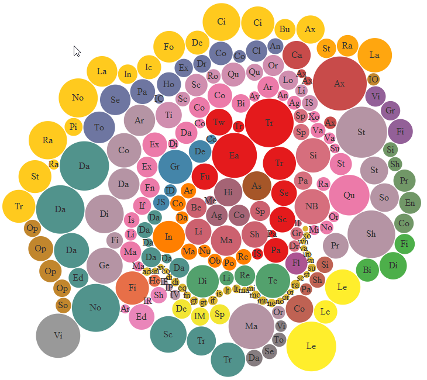

<!--
  %\VignetteEngine{knitr::rmarkdown}
  %\VignetteIndexEntry{Example applications of data.tre}
  %\SweaveUTF8
-->


# Introduction

## Useful applications of data.tree

data.tree has proven to be useful in the following fields:

* Finance: Calculate and display a portfolio breakdown, i.e. calculate exposure to various asset classes and sub-assetclasses. For some inspiration, type `demo(portfolio)`
* Machine Learning: quickly build or prototype a new classification algorithm. Type `vignette(ID3)` for an example.
* Convert a complex JSON document to a data.frame (or vice versa). See `demo(bubbles)`
* Decision Trees: Create, calculate, and plot decision trees. For an example, see `demo(decisiontree)`
* Computer Science: Teaching Search Algorithms. While I would not go as far as recommending to use data.tree to develop real-world search algorithms, its clean syntax and flexibility can be very useful for classroom exercises
* Game Theory / Game Complexity: What is the average branching factor of Tic-Tac-Toe?
* Display data in a hierarchic html widget. See e.g. `demo(decisiontree)`
* Bioinformatics: For an example, see `demo(genedefect)`
* Utility: print files in a directory structure. See `demo(files)`


If you are using data.tree for things not listed here, drop us a note. 

This vignette gives you a quick introduction to data.tree applications. We took care to keep the examples simple enough so non-specialists can follow them. 

#ID3

## Introduction

This example shows you the following:
* How to build a data.tree structure in an algorithm
* How to prune a tree
* How to use data.tree to develop learning algorithms

## What is ID3?

This vignette provides a stylized example of the capabilities of the data.tree package. 
The code for this vignette was written in less than an hour. This is possible because, thanks to the data.tree package.
The implementation of the training algorithm follows the algorithm's pseudo code almost line by line.

Classification trees are very populare these days. If you have never come accross them, you might be interested in this: [classification trees](http://en.wikipedia.org/wiki/Decision_tree_learning). These models let you *classify* observations (e.g. things, outcomes) according to the observations' qualities, called *features*. Essentially, all of these models consist of creating a *tree*, where each *node* acts as a *router*. You insert your mushroom *instance* at the *root* of the tree, and then, depending on the mushroom's *features* (size, points, color, etc.), you follow along a different *path*, until a *leaf* node spits out your mushroom's *class*, i.e. whether it's edibel or not. 

You might have guessed already that there are two different steps involved in using such a model: *training* (i.e. constructing the tree), and *predicting* (i.e. using the tree to predict whether a given mushroom is poisonous). This vignette provides code to do both, using one of the very early algorithms to classify data according to discrete features: [ID3](http://en.wikipedia.org/wiki/ID3_algorithm). Just to avoid confusion: I do not suggest that ID3 is particularly appropriate for anything else then teaching introductory courses.

We will not go into more details about ID3. You will find lots of documentation on this and more refined algorithms on the internet. 

## Feature Selection

As mentioned above, during the prediction step, each node routes our mushroom according to a feature. But how do we chose the feature? Should we first separate our set according to color or size? That is where classification models differ. 

In ID3, we pick at each node the feature with the highest *Information Gain*. In a nutshell, this is the feature which splits the sample in the possibly *purest* subsets. For example, in the case of mushrooms, "dots" might be a more sensible feature than "organic". 

### Purity and Entropy


```{r}
IsPure <- function(data) {
  length(unique(data[,ncol(data)])) == 1
}
```

The *entropy* is a measure of the purity of a dataset. 

```{r}
Entropy <- function( vls ) {
  res <- vls/sum(vls) * log2(vls/sum(vls))
  res[vls == 0] <- 0
  -sum(res)
}
```


### Information Gain

Mathematically, the information gain IG is defined as:

$$ IG(T,a) = H(T)-\sum_{v\in vals(a)}\frac{|\{\textbf{x}\in T|x_a=v\}|}{|T|} \cdot H(\{\textbf{x}\in T|x_a=v\}) $$

In words, the information gain measures the *difference* between the entropy *before the split*, and the weighted sum of the entropies *after the split*:

So, let's rewrite that in R:


```{r}

InformationGain <- function( tble ) {
  tble <- as.data.frame.matrix(tble)
  entropyBefore <- Entropy(colSums(tble))
  s <- rowSums(tble)
  entropyAfter <- sum (s / sum(s) * apply(tble, MARGIN = 1, FUN = Entropy ))
  informationGain <- entropyBefore - entropyAfter
  return (informationGain)
}
```


## The ID3 algorithm

### Pseudo code

We are all set for the ID3 training algorithm. We start with the entire training data, and with a root. Then:

1. if the data-set is pure (e.g. all toxic), then  
    1. construct a leaf having the name of the class (e.g. 'toxic')
2. else  
    1. choose the feature with the highest information gain (e.g. 'color')
    2. for each value of that feature (e.g. 'red', 'brown', 'green')
        1. take the subset of the data-set having that feature value
        2. construct a child node having the name of that feature value (e.g. 'red')
        3. call the algorithm recursively on the child node and the subset

### Implementation in R with the data.tree package

For the following implementation, we assume that the classifying features are in columns 1 to n-1, whereas the class (the edibility) is in the last column.

```{r}
TrainID3 <- function(node, data) {
    
  node$obsCount <- nrow(data)
  
  #if the data-set is pure (e.g. all toxic), then
  if (IsPure(data)) {
    #construct a leaf having the name of the pure feature (e.g. 'toxic')
    child <- node$AddChild(unique(data[,ncol(data)]))
    node$feature <- tail(names(data), 1)
    child$obsCount <- nrow(data)
    child$feature <- ''
  } else {
    #chose the feature with the highest information gain (e.g. 'color')
    ig <- sapply(colnames(data)[-ncol(data)], 
            function(x) InformationGain(
              table(data[,x], data[,ncol(data)])
              )
            )
    feature <- names(ig)[ig == max(ig)][1]
    
    node$feature <- feature
    
    #take the subset of the data-set having that feature value
    childObs <- split(data[,!(names(data) %in% feature)], data[,feature], drop = TRUE)
    
    for(i in 1:length(childObs)) {
      #construct a child having the name of that feature value (e.g. 'red')
      child <- node$AddChild(names(childObs)[i])
      
      #call the algorithm recursively on the child and the subset      
      TrainID3(child, childObs[[i]])
    }
    
  }
  
  

}
```

### Training with data

Our training data looks like this:

```{r}
library(data.tree)
data(mushroom)
mushroom
```

Indeed, a bit small. But you get the idea.

We are ready to train our decision tree by running the function:


```{r}

tree <- Node$new("mushroom")
TrainID3(tree, mushroom)
print(tree, "feature", "obsCount")

```


## Prediction

### The prediction method

Now, let's predict some classes. For this, we need a predict function, which will route data through our tree:

```{r}

Predict <- function(tree, features) {
  if (tree$children[[1]]$isLeaf) return (tree$children[[1]]$name)
  child <- tree$children[[features[[tree$feature]]]]
  return ( Predict(child, features))
}

```

### Using the prediction method

And now we use it to predict:

```{r}
Predict(tree, c(color = 'red', 
                size = 'large', 
                points = 'yes')
        )
```

Oops, trusting classification blindly might be dangerious ;-)

# Decision Tree

## Introduction

This demo calculates and plots a simple decision tree. It demonstrates the following:
* how can I read a yaml file into a data.tree structure?
* how can I calculate a decision tree?
* how can I plot my data.tree with the ape package?
* how can I plot my data.tree with the DiagrammeR package? 

## Loading a YAML file

YAML is similar to JSON, but targeted towards humans (as opposed to computers). It's consise and easy to read.
YAML can be a neat format to store your data.tree structures, as you can use it across different software
and systems, you can edit it with any text editor. You can even send it as an email.

This is how our YAML file looks:

```{r}

fileName <- '../inst/extdata/jennylind.yaml'
cat(readChar(fileName, file.info(fileName)$size))

```

Let's convert the YAML into a data.tree structure. First, we load it with the yaml package into a list of list. Then we use as.Node to convert the list into a data.tree structure:

```{r}

library(data.tree)
library(yaml)
l <- yaml.load_file(fileName)
jl <- as.Node(l)
print(jl, "type", "payoff", "p")
```


## Calculate the decision tree

Next, we define our payoff function, and apply it to the tree. Note that we use post-order traversal, meaning that we calculate the tree from leaf to root:

```{r}

payoff <- function(x) {
  if (x$type == 'chance') x$payoff <- Aggregate(x, function(node) node$payoff * node$p, sum)
  else if (x$type == 'decision') x$payoff <- Aggregate(x, "payoff", max)
}

jl$Do(payoff, traversal = "post-order", filterFun = isNotLeaf)

```

The decision function is the next step. Note that we filter on decision nodes:

```{r}
decision <- function(x) {
  po <- sapply(x$children, function(child) child$payoff)
  x$decision <- names(po[po == x$payoff])
}

jl$Do(decision, filterFun = function(x) x$type == 'decision')


```

## Plot the tree

### Plot with the ape package

The ape package was built to manage and plot phylogenetic trees. However, its infrastructure can also be used to plot our decision tree.

First, we revert the order of the nodes in the tree (so it's displayed from top to bottom, as ape does it the other way around). Then we convert the data.tree structure to a phylo object:


```{r}

library(ape)
jl$Revert()
jlp <- as.phylo(jl)


```

Now we are ready to plot.

First, we'll define a function to format the node labels. We'll use it later.

```{r}
Nodelabel <- function(node) {
  po <- paste0( '$ ', format(node$payoff, scientific = FALSE, big.mark = "'"))
  if (node$type == 'terminal') return (po)
  return ( paste0('ER\n', po) )
}

```

Here's the plotting:

```{r}

par(mar=c(1,1,1,1))
plot(jlp, show.tip.label = FALSE, type = "cladogram")


#We set arrow heads to the leaf-edges:
for (node in jl$leaves) edges(GetPhyloNr(node$parent, "node"), GetPhyloNr(node, "node"), arrows = 2, type = "triangle", angle = 60)

#Finally, we iterate over all the nodes and print the labels. Note that the `GetPhyloNr`
#methods lets us map a `Node` in the data.tree to its counterpart in the phylo object.


for(node in Traverse(jl)) {
  if(node$type == 'decision') {
    nodelabels(Nodelabel(node), GetPhyloNr(node, "node"), frame = 'none', adj = c(0.3, -0.5))
  } else if(node$type == 'chance') {
    if (node$name == node$parent$decision) edges(GetPhyloNr(node$parent, "node"), GetPhyloNr(node, "node"), col = "red")
    nodelabels(" ", GetPhyloNr(node, "node"), frame = "circle")
    nodelabels(Nodelabel(node), GetPhyloNr(node, "node"), frame = 'none', adj = c(0.5, -0.5))
    edgelabels(node$name, GetPhyloNr(node, "edge"), bg = "white")
  } else if(node$type == 'terminal') {
    tiplabels(Nodelabel(node), GetPhyloNr(node, "node"), frame = "none", adj = c(0.5, -0.6))
    edgelabels(paste0(node$name," (", node$p, ")"), GetPhyloNr(node, "edge"), bg = "white")
  }
}

nodelabels("   ", GetPhyloNr(jl, "node"), frame = "rect")

```

### Plotting with DiagrammeR / Mermaid

First, we give each `Node` a unique id:

```{r}

library("DiagrammeR")

jl$Set(id = letters[1:(jl$totalCount)])


```

Next, we define label functions and formats:

```{r}

FromLabel <- function(node) {
  if(node$parent$isRoot) return (ToLabel(node$parent))
  return (as.character(node$parent$id))
}

EdgeLabel <- function(node) {
  if (node$type == "decision") {
    return ('')
  } else if (node$type == "chance") {
    lbl <- node$name
  } else if (node$type == "terminal") {
    lbl <- paste0(node$name,": ", node$p)
  }
  lbl <- paste0(" --> |", lbl, "|")
  return (lbl)
}

FormatPayoff <- function(payoff) {
  paste0("$", payoff/1000, "k")
}

ToLabel <- function(node) {
  if (node$type == "decision") {
    lbl <- paste0("[", FormatPayoff(node$payoff), "]")
  } else if (node$type == "chance") {
    lbl <- paste0("((", FormatPayoff(node$payoff), "))")
  } else if (node$type == "terminal") {
    lbl <- paste0("[", FormatPayoff(node$payoff), "]")
  }
  lbl <- paste0(" ", node$id, lbl)
  return (lbl)
}


```

Finally, we paste together our Mermaid string defining our graph:

```{r}

format <- paste0(
  "classDef default fill:none, bg:none, stroke-width:0px;
classDef decision fill:#9f6,stroke:#333,stroke-width:1px;
classDef chance fill:red,stroke:#333,stroke-width:1px;
class ", paste(jl$Get("id", filterFun = function(x) x$type == "decision"), collapse = ","), " decision;
class ", paste(jl$Get("id", filterFun = function(x) x$type == "chance"), collapse = ","), " chance;")
format <- ""
t <- Traverse(jl, traversal = "level", filterFun = isNotRoot)
df <- data.frame(from = Get(t, FromLabel), edge = Get(t, EdgeLabel), to = Get(t, ToLabel))

diagram <- paste("graph LR", paste( paste0(df$from, df$edge, df$to), collapse = "\n"), format, sep = "\n")

diagram

DiagrammeR(diagram)

```

# JSON Conversion

In this example, we will replicate Mike Bostock's bubble example. See here for details: http://bl.ocks.org/mbostock/4063269
We use Joe Cheng's bubbles package. All this is inspired by (Timelyportfolio)[http://bl.ocks.org/timelyportfolio], the king of html widgets.

You'll learn how to convert a complex JSON into a data.frame

The JSON is long and complicated:

```{r}
library(jsonlite)
library(curl)

flareJSON <- paste(readLines(curl("http://bl.ocks.org/mbostock/raw/4063269/flare.json"), warn = FALSE), collapse = "\n")

cat(substr(flareJSON, 1, 300))

```

So, let's convert it into a data.tree structure:

```{r}

flareLoL <- fromJSON("http://bl.ocks.org/mbostock/raw/4063269/flare.json",
                     simplifyDataFrame = FALSE
                     )

flareTree <- as.Node(flareLoL, mode = "explicit")
flareTree$fieldsAll
print(flareTree, "size", limit = 30)

```

Finally, we can convert it into a data.frame. The `ToDataFrameTable` only converts leafs, but inherits attributes
from ancestors:

```{r}

flare_df <- ToDataFrameTable(flareTree, 
                             className = function(x) x$parent$name, 
                             packageName = "name", 
                             "size")
head(flare_df)

```


This does not look spectacular. But take a look at this [stack overflow](http://stackoverflow.com/questions/31339805/converting-json-format-to-csv-to-upload-data-table-in-r-to-produce-d3-bubble-cha) question to see how people struggle to do this type of operation. 

Here, it was particularly simple, because the underlying JSON structure is regular. If it were not, we could modify the data.tree structure before converting it into a data.frame. For example, we could use `Prune` to remove unwanted nodes.

What follows has nothing to do with data.tree anymore. We simply provide the bubble chart printing for your enjoyment. In order to run it yourself, you need to install the bubbles package from github:


```{r, eval=FALSE}

devtools::install_github("jcheng5/bubbles")
library(scales)
library(bubbles)
library(RColorBrewer)
bubbles(
  flare_df$size,
  substr(flare_df$packageName, 1, 2),
  tooltip = flare_df$packageName,
  color = col_factor(
    brewer.pal(9,"Set1"),
    factor(flare_df$className)
  )(flare_df$className),
  height = 800,
  width = 800
)
```



Note that if you run it yourself, you'll see that the tooltips are actually working, and displaying the full package names. In the chart itself, we only disply the first two letters for better readability.