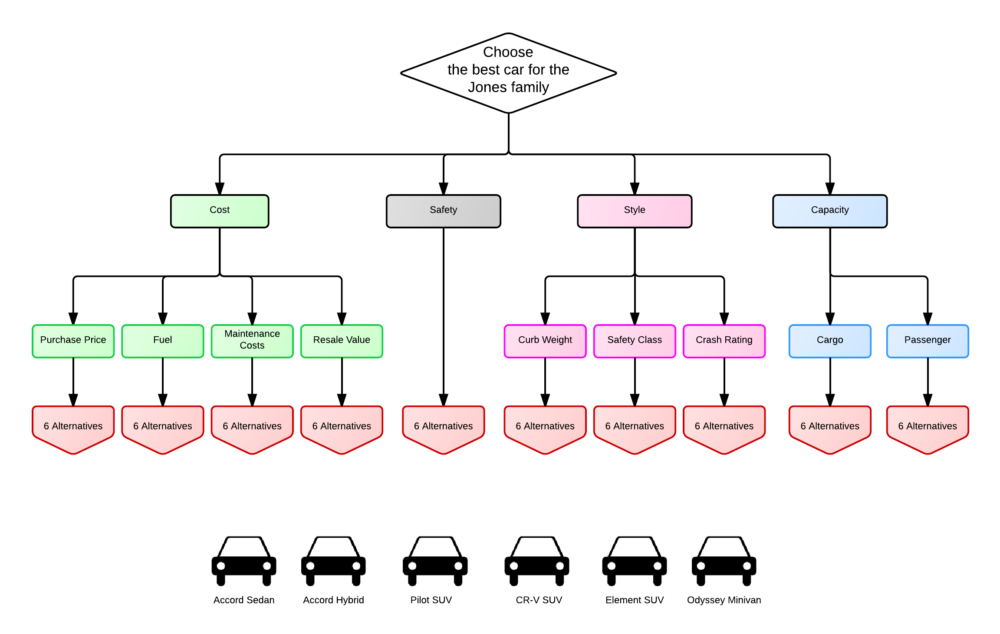

## Introduction

In this example, the Jones family wants to buy a new car.
This document follows the [Wikipedia AHP Car Example](http://en.wikipedia.org/wiki/Analytic_hierarchy_process_%E2%80%94_Car_example). Even though a few details are different, the original article is required to follow along.

## Creating the AHP criteria tree

When deciding which car to buy, the family considers the following criteria: cost, safety, style, and capacity, and their sub-criteria. 

The Jones' have a shortlist of 6 cars.

We can draw the hierarchy like this:



Using the ahp package, the ahp hierarchy tree can be constructed like so:

```{r tidy=FALSE}
library(ahp)
goal <- AhpNode$new("Car")
  cost <- goal$AddChild("Cost")
    purchasePrice <- cost$AddChild("Purchase_Price")
    fuelCosts <- cost$AddChild("Fuel_Costs")
    maintenanceCosts <- cost$AddChild("Maintenance_Costs")
    resaleValue <- cost$AddChild("Resale_Value")
  safety <- goal$AddChild("Safety")
    curbWeight <- safety$AddChild("Curb_Weight")
    safetyClass <- safety$AddChild("Safety_Class")
    crashRating <- safety$AddChild("Crash_Rating")
  style <- goal$AddChild("Style")
  capacity <- goal$AddChild("Capacity")
    cargoCapacity <- capacity$AddChild("Cargo_Capacity")
    passengerCapacity <- capacity$AddChild("Passenger_Capacity")

print(goal, cols="level")
```

## Criteria

What is more important, style or safety? AHP allows expressing an individual's or a group's opinion by polling the pairwise preferences on a scale of 1 to 9, and their inverse. 1 means two categories are equally important. 9 means A is strictly preferred to B. 1/9 means B is strictly preferrable to A.

In order to apply the AHP algorithm in order to calculate the *priorities*, one needs to construct a *preference matrix*. The ahp package, however, provides a utility method to construct such a matrix.

### Setting the Preferences

We start by setting the level one criteria preferences. These are:

```{r}
names(goal$children)
```


Since AHP requires setting preferences for each pairwise combination of criteria, the ahp package provides a utility method to quickly list all such pairwise preferences:

```{r}
pp <- goal$GetChildCombinations()
```

Note that, by default, all preferences are set to 1. The cost criteria, say, is equally important as the style criteria. This is, however, not the case for the Jones family. So we now fill the pairwise preferences, as perceived by the Jones'. To do this, we can use the utility function `printForInput`:

```{r}
printForInput(pp)
```

We can copy and paste the output and replace the 1's with the appropriate subjective value:


```{r}
pp <- setPreference(pp, "Cost"   , "Safety"  , 3) #cost is more important than safety
pp <- setPreference(pp, "Cost"   , "Style"   , 7) #cost is much more important than style
pp <- setPreference(pp, "Cost"   , "Capacity", 3) #cost is more important than capacity
pp <- setPreference(pp, "Safety" , "Style"   , 9)
pp <- setPreference(pp, "Safety" , "Capacity", 1) #safety and capacity are equally important
pp <- setPreference(pp, "Style"  , "Capacity", 1/7) #capacity is much more important than style
```

A technical side node: you may have realised that `pp`, the pairwise child combinations of our categories, is a standard `data.frame`, and not an R6 reference class. As a result, we must re-assign `pp`, using e.g. `pp <- setPreference(pp, "Cost"   , "Safety"  , 3)`.

From the pairwise preferences, we create the ahp preference matrix:

```{r}
preferenceMatrix <- AhpMatrix(pp)
preferenceMatrix
```

This matrix has 1's along the diagonal, obviously, and for preferences $P$ the following holds true $P_{i,j}=\frac{1}{P_{j,i}}  \forall i,j$

### Calculating the Priorities

From the *preference matrix*, we can directly calculate the *priorities* by using the AHP algorithm. The `AhpNode` class provides this functionality out of the box. All we need to do is to set the preference matrix in the ahp tree, on the parent node. This will then automatically calculate the level 1 priorities:

```{r}
goal$SetChildPreferenceMatrix(preferenceMatrix)
```

The level 1 priorities have now been calculated for us:

```{r}
priorities(goal)
```

As preferences are expressed *pairwise*, it is possible that our preferences are inconsistent. The AHP algorithm introduces a consistency measure to check whether our pairwise preferences make sense. This consistency measure is obtained like this:

```{r}
goal$childConsistency
```

Remember that the lower the consistency, the better.

The ahp tree now looks like this:

```{r}
goal
```

## Sub-Criteria

### Cost

The AHP tree looks still incomplete. We need to set pairwise preferences for each combination, at each node. Let us continue with the preferences of the sub-categories below the *Cost* node:


```{r}
pp <- goal$Find(Cost)$GetChildCombinations()
#printForInput(pp)

pp <- setPreference(pp, "Purchase Price"   , "Fuel Costs"       , 2)
pp <- setPreference(pp, "Purchase Price"   , "Maintenance Costs", 5)
pp <- setPreference(pp, "Purchase Price"   , "Resale Value"     , 3)
pp <- setPreference(pp, "Fuel Costs"       , "Maintenance Costs", 2)
pp <- setPreference(pp, "Fuel Costs"       , "Resale Value"     , 2)
pp <- setPreference(pp, "Maintenance Costs", "Resale Value"     , 1/2)

preferenceMatrix <- AhpMatrix(pp)
goal$Find(Cost)$SetChildPreferenceMatrix(preferenceMatrix)

priorities(goal$Find(Cost))
```

Note that the sum of the priorities is equal to 1:

```{r}
sum(priorities(goal$Find(Cost)))
```

Our AHP tree looks already a bit more complete:

```{r}
goal
```

We now need to do the same thing for Safety and Capacity. Note that we do not have to do anything for style, as style does not have sub-criteria.

### Safety

This should be straight forward by now:

```{r}
pp <- goal$Find(Safety)$GetChildCombinations()
#printForInput(pp)

pp <- setPreference(pp, "Curb Weight"   , "Safety Class", 3)
pp <- setPreference(pp, "Curb Weight"   , "Crash Rating", 2)
pp <- setPreference(pp, "Safety Class"  , "Crash Rating", 1/2)

preferenceMatrix <- AhpMatrix(pp)
goal$Find(Safety)$SetChildPreferenceMatrix(preferenceMatrix)

goal$Find(Safety)

```

### Capacity

```{r}
pp <- goal$Find(Capacity)$GetChildCombinations()
#printForInput(pp)

pp <- setPreference(pp, "Cargo Capacity", "Passenger Capacity", 1/5)
preferenceMatrix <- AhpMatrix(pp)
goal$Find(Capacity)$SetChildPreferenceMatrix(preferenceMatrix)
```

Our AHP tree now looks like this:

```{r}
goal
```

We establish that consistency is acceptable everywhere, and that for example purchase price is roughly six times more important than cargo capacity.

## Alternatives

We are now ready to move to the next steps: Alternatives.
The Jones family has researched and has 6 cars on their shortlist.

```{r}
accord_sedan <- Alternative$new("Accord Sedan")
accord_hybrid <- Alternative$new("Accord Hybrid")
pilot <- Alternative$new("Pilot SUV")
crv <- Alternative$new("CR-V SUV")
element <- Alternative$new("Element SUV")
odyssey <- Alternative$new("Odyssey Minivan")
```

### Adding the Alternatives

We add these alternatives to the goal:

```{r}
alternatives <-  AlternativesList(accord_sedan = accord_sedan,
                     accord_hybrid = accord_hybrid,
                     pilot = pilot,
                     crv = crv,
                     element = element,
                     odyssey = odyssey
                     )

goal$AddAlternatives(alternatives)
```

This method adds each alternative to each leaf-category. Our AHP tree now looks like this:

```{r}
head(as.data.frame(goal), 20)
```

The next step is to set our alternative-preferences for each category. The principle is the same: for each leaf criteria, we create a preference matrix containing the comparison of all alternative combinations.

Let us start with the purchase price.

### Cost Alternatives

#### Purchase Price: Using a preference function

We start by adding a custom attribute, price, to each alternative:

```{r}
accord_sedan$price <- 20360
accord_hybrid$price <- 31090
pilot$price <- 27595
crv$price <- 20700
element$price <- 18980
odyssey$price <- 25645
```

According to the Jones family, the pairwise preference with respect to the purchase price depends on the absolute price of each car, but also on the price difference between two cars.  If the price is above 26000 USD, we shun it. If the price is above 25000 USD, we don't like it. Otherwise, if a car's price much cheaper then the other car, we like it.

We could now set the preferences according to these rules manually. Luckily, though, the ahp package provides us with a utility function, `CalculatePreferences`. This function sits on the `AhpNode`, and takes a function as an input. 

By convention, the function passed to `CalculatePreferences` must take two `Alternative` instances as input. It must return the pairwise preference in ahp manner (1/9, 1/8 ... 1/2, 1, 2, ... 9)

Note that, to keep it simple, the function we use is slightly different from the tutorial on wikipedia.

```{r}
purchasePricePreference <- function(car1, car2) {
  
  kSoftBudget <- 25000
  kHardBudget <- 26000
  
  if (car1$price > kHardBudget && car2$price > kHardBudget) {
    return (1)
  }
  
  if (car1$price <= kSoftBudget && car2$price > kHardBudget) {
    return (9)
  }
  
  if (car1$price <= kSoftBudget && car2$price > kSoftBudget) {
    return (7)
  }
  
  
  if (car1$price < car2$price) {
    pref <- max(1, min(9, round((car2$price - car1$price)/1000)))
    return (pref)
  }
  
  #looks like car2 is preferred
  return (1/purchasePricePreference(car2, car1))
  
}

```

Once we have defined the preference function , we pass it to the `CalculatePreferences` method

```{r}
goal$Find(Cost, Purchase_Price)$CalculatePreferences(purchasePricePreference)

```

The node has automatically calculated the ahp preference matrix ...


```{r}
goal$Find(Cost, Purchase_Price)$preferenceMatrix

```

... as well as the priorities:
```{r}
priorities(goal$Find(Cost, Purchase_Price))

```

#### Fuel Costs

The cars have the following MPG (miles per gallon) value:

```{r}
accord_sedan$mpg <- 31
accord_hybrid$mpg <- 35
pilot$mpg <- 22
crv$mpg <- 27
element$mpg <- 25
odyssey$mpg <- 26
```

The Jones family has the following preference function:

```{r}
fuelCostFunction <- function(car1, car2) {
  return (car1$mpg / car2$mpg)
}
```
This is all we need to calculate the preferences:

```{r}
goal$Find(Cost, Fuel_Costs)$CalculatePreferences(fuelCostFunction)
sort(priorities(goal$Find(Cost, Fuel_Costs)), decreasing = TRUE)

```

#### Maintenance Costs: Pairwise Comparison

The Jones family takes into consideration tire costs, brakes cost, consumer reports, and special costs (such as battery for the hybrid cars). Their pairwise comparison yields:

```{r}
pp <- goal$Find(Cost, Maintenance_Costs)$GetChildCombinations()
#printForInput(pp)
pp <- setPreference(pp, "Accord Sedan", "Accord Hybrid", 1.5)
pp <- setPreference(pp, "Accord Sedan", "Pilot SUV", 4)
pp <- setPreference(pp, "Accord Sedan", "CR-V SUV", 4)
pp <- setPreference(pp, "Accord Sedan", "Element SUV", 5)
pp <- setPreference(pp, "Accord Sedan", "Odyssey Minivan", 5)
pp <- setPreference(pp, "Accord Hybrid", "Pilot SUV", 1.5)
pp <- setPreference(pp, "Accord Hybrid", "CR-V SUV", 4)
pp <- setPreference(pp, "Accord Hybrid", "Element SUV", 4)
pp <- setPreference(pp, "Accord Hybrid", "Odyssey Minivan", 5)
pp <- setPreference(pp, "Pilot SUV", "CR-V SUV", 1)
pp <- setPreference(pp, "Pilot SUV", "Element SUV", 1.2)
pp <- setPreference(pp, "Pilot SUV", "Odyssey Minivan", 1)
pp <- setPreference(pp, "CR-V SUV", "Element SUV", 1)
pp <- setPreference(pp, "CR-V SUV", "Odyssey Minivan", 3)
pp <- setPreference(pp, "Element SUV", "Odyssey Minivan", 2)

preferenceMatrix <- AhpMatrix(pp)
goal$Find(Cost, Maintenance_Costs)$SetChildPreferenceMatrix(preferenceMatrix)

priorities(goal$Find(Cost, Maintenance_Costs))

```
### Resale Value

The leasing residual value after 12'000 miles of the cars is:


```{r}
accord_sedan$residualValue <- 0.52
accord_hybrid$residualValue <- 0.46
pilot$residualValue <- 0.44
crv$residualValue <- 0.55
element$residualValue <- 0.48
odyssey$residualValue <- 0.48
```

Their preference function is (again simplifying slightly):

```{r}

resaleValuePreference <- function(car1, car2) {
  ratio <- car1$residualValue / car2$residualValue
  if (ratio < 1) return (1/resaleValuePreference(car2, car1))
  value <- max(1, min(9, ceiling(100*(ratio-1)/5)))
  return (value)
}

goal$Find(Cost, Resale_Value)$CalculatePreferences(resaleValuePreference)
priorities(goal$Find(Cost, Resale_Value))

```


### Safety

Sticking to the somewhat odd order of the Wikipedia example, we now enter preferences for the Safety sub-categories. Note that in the Wikipedia example, the Safety sub-categories are all processed as a single category. However, thanks to the ahp facility, separating them into single sub-categories is very intuitive.
However, if you had rather follow the Wikipedia example, you should now be fit to do this on your own as an exercise.

#### Curb Weight: Using the built-in LinearComparison function

We first add the curb weight as a property to the `Alternative`:

```{r}
accord_sedan$curb_weight <- 3289
accord_hybrid$curb_weight <- 3501
pilot$curb_weight <- 4264
crv$curb_weight <- 3389
element$curb_weight <- 3433
odyssey$curb_weight <- 4385

```

The Jones' believe that a heavier car is safer. 
We use the ahp package utility function `LinearComparison`, assuming that the overall lightest existing car is 3000, and the heaviest ist 5000.
Note that we pass along additional parameters to the LinearComparison function.

```{r}
goal$Find(Safety, Curb_Weight)$CalculatePreferences(LinearComparison, fieldName = "curb_weight", min_x = 3000, max_x = 5000)
```

This will, for example 
* give a preference of 9 to a car weighing 5000, if compared to an alternative weighing 3000
* give a preference of 5 to the heavier car if the weight difference is 1000

That's all there is to it. Our preferences are readily calculated:

```{r}
goal$Find(Safety, Curb_Weight)
```

As expected, the heaviest car has the highest priority.
If the Jones' believe that this gives too much weight to the heaviest one, they could simply recalculate the preferences with different settings, e.g.

```{r}
goal$Find(Safety, Curb_Weight)$CalculatePreferences(LinearComparison, fieldName = "curb_weight", min_x = 2000, max_x = 5500)
goal$Find(Safety, Curb_Weight)
```

#### Safety Class: Using ApplyPreferenceMatrix

Safety class is a classification of cars. 
Let's start, again, by classifying our cars:

```{r}
accord_sedan$safetyClass <- "Midsize Car"
accord_hybrid$safetyClass <- "Midsize Car"
pilot$safetyClass <- "Midsize SUV"
crv$safetyClass <- "Small SUV"
element$safetyClass <- "Small SUV"
odyssey$safetyClass <- "Minivan"
```

Which safety class is to be preferred? This looks like an AHP problem in itself, and so we treat it as such:

```{r}
safetyClassGoal <- AhpNode$new("Safety Class Goal")
safetyClassGoal$AddChild("Midsize Car")
safetyClassGoal$AddChild("Midsize SUV")
safetyClassGoal$AddChild("Small SUV")
safetyClassGoal$AddChild("Minivan")

pp <- safetyClassGoal$GetChildCombinations()
#printForInput(pp)

pp <- setPreference(pp, "Midsize Car", "Midsize SUV", 1/4)
pp <- setPreference(pp, "Midsize Car", "Small SUV"  , 1/2)
pp <- setPreference(pp, "Midsize Car", "Minivan"    , 2)
pp <- setPreference(pp, "Midsize SUV", "Small SUV"  , 3)
pp <- setPreference(pp, "Midsize SUV", "Minivan"    , 5)
pp <- setPreference(pp, "Small SUV"  , "Minivan"    , 2)

preferenceMatrix <- AhpMatrix(pp)
safetyClassGoal$SetChildPreferenceMatrix(preferenceMatrix)

priorities(safetyClassGoal)

```

We apply the preferenceMatrix to the Safety Class criteria in our original AHP tree. The method `ApplyPreferenceMatrix` makes sure that the preferences are inherited from the `safetyClassGoal`, according to the car `alternative$safetyClass`. The second argument, `safetyClass`, specifies the name of the property in our Alternatives list which contains the safety class.

```{r}

goal$Find(Safety, Safety_Class)$ApplyPreferenceMatrix(preferenceMatrix, safetyClass)
priorities(goal$Find(Safety, Safety_Class))
```


#### Crash Rating

All the cars have a 5 star rating, except in specific categories:

```{r}
accord_sedan$crashRating <- "4 in Side Impact Front"
accord_hybrid$crashRating <- "4 in Side Impact Front"
pilot$crashRating <- "4 in Rollover"
crv$crashRating <- "4 in Rollover"
element$crashRating <- "3 in Rollover"
odyssey$crashRating <- "All 5 Stars"
```

Again, we model the ratings as a separate little AHP problem:

```{r}
crashRatingGoal <- AhpNode$new("Crash Rating Goal")
crashRatingGoal$AddChild("4 in Side Impact Front")
crashRatingGoal$AddChild("4 in Rollover")
crashRatingGoal$AddChild("3 in Rollover")
crashRatingGoal$AddChild("All 5 Stars")

pp <- crashRatingGoal$GetChildCombinations()
#printForInput(pp)

pp <- setPreference(pp, "4 in Side Impact Front", "4 in Rollover", 2)
pp <- setPreference(pp, "4 in Side Impact Front", "3 in Rollover", 5)
pp <- setPreference(pp, "4 in Side Impact Front", "All 5 Stars"  , 3)
pp <- setPreference(pp, "4 in Rollover"         , "3 in Rollover", 3)
pp <- setPreference(pp, "4 in Rollover"         , "All 5 Stars"  , 1/4)
pp <- setPreference(pp, "3 in Rollover"         , "All 5 Stars"  , 1/6)

preferenceMatrix <- AhpMatrix(pp)

goal$Find(Safety, Crash_Rating)$ApplyPreferenceMatrix(preferenceMatrix, crashRating)
priorities(goal$Find(Safety, Crash_Rating))
```

### Style

Style is a subjective criteria, so the pairwise comparison is simply done according to personal taste:

```{r}
pp <- goal$Find("Style")$GetChildCombinations()
#printForInput(pp)
pp <- setPreference(pp, "Accord Sedan", "Accord Hybrid", 1)
pp <- setPreference(pp, "Accord Sedan", "Pilot SUV", 7)
pp <- setPreference(pp, "Accord Sedan", "CR-V SUV", 5)
pp <- setPreference(pp, "Accord Sedan", "Element SUV", 9)
pp <- setPreference(pp, "Accord Sedan", "Odyssey Minivan", 6)
pp <- setPreference(pp, "Accord Hybrid", "Pilot SUV", 7)
pp <- setPreference(pp, "Accord Hybrid", "CR-V SUV", 5)
pp <- setPreference(pp, "Accord Hybrid", "Element SUV", 9)
pp <- setPreference(pp, "Accord Hybrid", "Odyssey Minivan", 6)
pp <- setPreference(pp, "Pilot SUV", "CR-V SUV", 1/6)
pp <- setPreference(pp, "Pilot SUV", "Element SUV", 3)
pp <- setPreference(pp, "Pilot SUV", "Odyssey Minivan", 1/3)
pp <- setPreference(pp, "CR-V SUV", "Element SUV", 7)
pp <- setPreference(pp, "CR-V SUV", "Odyssey Minivan", 5)
pp <- setPreference(pp, "Element SUV", "Odyssey Minivan", 1/5)

preferenceMatrix <- AhpMatrix(pp)
goal$Find("Style")$SetChildPreferenceMatrix(preferenceMatrix)

priorities(goal$Find("Style"))

```

### Capacity

#### Cargo Capacity

```{r}
accord_sedan$cargo <- 14
accord_hybrid$cargo <- 14
pilot$cargo <- 87.6
crv$cargo <- 72.9
element$cargo <- 74.6
odyssey$cargo <- 147.4
```

Their preference function is (again simplifying slightly):

```{r}
getCargoClass <- function(car) {
    if (car$cargo >= 140) return (3)
    if (car$cargo >= 70) return (2)
    else return (1)
}

cargoPreference <- function(car1, car2) {
   if (car1$cargo < car2$cargo) return (1/cargoPreference(car2, car1))
   value <- getCargoClass(car1) - getCargoClass(car2) + 1
   return (value)
   
}


goal$Find(Capacity, Cargo_Capacity)$CalculatePreferences(cargoPreference)
priorities(goal$Find(Capacity, Cargo_Capacity))

```

#### Passenger Capacity

Again, we solve this using the ApplyPreferenceMatrix method:

```{r}
accord_sedan$passenger <- "5"
accord_hybrid$passenger <- "5"
pilot$passenger <- "8"
crv$passenger <- "5"
element$passenger <- "4"
odyssey$passenger <- "8"

passengerGoal <- AhpNode$new("Passenger Capacity Goal")
passengerGoal$AddChild("4")
passengerGoal$AddChild("5")
passengerGoal$AddChild("8")

pp <- passengerGoal$GetChildCombinations()
#printForInput(pp)

pp <- setPreference(pp, "4", "5", 1/3)
pp <- setPreference(pp, "4", "8", 1/6)
pp <- setPreference(pp, "5", "8", 1/2)

goal$Find(Capacity, Passenger_Capacity)$ApplyPreferenceMatrix(AhpMatrix(pp), passenger)

priorities(goal$Find(Capacity, Passenger_Capacity))


```

## Making the Decision

```{r}
priorities <- sapply(alternatives, function(y) sum(sapply(y$alternativeNodes, function(x) x$globalPriority)))
priorities
```
And we have $\sum P=1$

```{r}
sum(priorities)
```
Finally, we can analyse our tree, in order to understand the source of our decision, and whether our choices were consistent:
```{r}
goal
```


